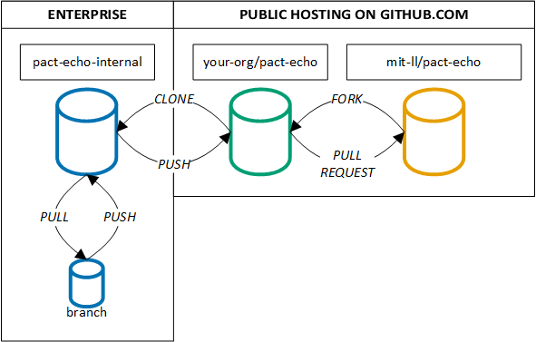

# How to contribute ##

We encourage the use of the [GitHub Issues](https://guides.github.com/features/issues/) for bug reports, new feature requests, etc. To streamline reporting, issues will only be enabled for the [pact-echo](https://github.com/mit-ll/pact-echo/) repository.

Due to the encounter models routine use in aviation research, we like to minimize the risk of inadvertent bugs or software challenges to maintain the encounter models as a trusted benchmark. To encourage traceability, development should occur via [forking](https://guides.github.com/activities/forking/).

- [How to contribute](#how-to-contribute)
  - [Code of Conduct](#code-of-conduct)
  - [Roadmap](#roadmap)
  - [Workflow](#workflow)
  - [Bugs](#bugs)
    - [Reporting Bugs](#reporting-bugs)
    - [Patching Bugs](#patching-bugs)
    - [Cosmetic Patch](#cosmetic-patch)
  - [Enhancements and New Features](#enhancements-and-new-features)
    - [Requesting features](#requesting-features)
    - [Developing features](#developing-features)
    - [Requesting documentation](#requesting-documentation)
  - [Convention Guide](#convention-guide)
    - [Character Encoding](#character-encoding)
    - [Documentation](#documentation)
    - [End of Line](#end-of-line)
    - [System Environment Variables](#system-environment-variables)
    - [Variable Names](#variable-names)
    - [Units](#units)
    - [Colors](#colors)
  - [Questions about the source code](#questions-about-the-source-code)
  - [Distribution Statement](#distribution-statement)

## Code of Conduct ##

This project and everyone participating in it is governed by the [Code of Conduct](CODE_OF_CONDUCT.md). By participating, you are expected to uphold this code. Please report unacceptable behavior to [pact-echo-admin@mit.edu](mailto:pact-echo-admin@mit.edu).

## Roadmap ##

No public technology roadmap for development is available yet. As the project matures, this may change.

## Workflow ##

A variety of organizations from academia, federal agencies, federal funded research and development centers (FFRDC), and industry have supported data collection for PACT. Each organization has different policies on release review and procedures to disseminate content. Organizations may also have their own enterprise self-hosted version control systems.

We recommend the following workflow that perseveres content part of the [pact-echo](https://github.com/mit-ll/pact-echo) repository as a "gold benchmark" while promoting a traceable workflow for contributors.



We'll use an illustrative example with an organization with strict release review policies, with their public organization (*your-org*) and a private enterprise system to explain this workflow. For organizations that permit public development, ignore steps with the enterprise instance.

1. The repository required for development is identified in [pact-echo](https://github.com/mit-ll/pact-echo)
2. This repository is forked by the *your-org* organization.
3. The new repository on *your-org* organization is cloned by the enterprise self-hosted GitHub. Note: you can't fork from public to private, see this Stack Overflow question for mitigations: [Is it possible to fork a public GitHub repo into an enterprise repository?](https://stackoverflow.com/q/29952033)
- Prior to any changes, there are now three instances of the repository: a private enterprise clone (pact-echo-internal), a public fork (your-org/pact-echo), and the original ([pact-echo](https://github.com/mit-ll/pact-echo)).
4. Development is conducted using branches on the enterprise clone.
5. When development is over, the clone will be reviewed for release according to internal policies.
6. Once the clone is approved for public release, changes will be pushed to the public fork.
7. A pull request will be opened to contribute back to the original.
8. The pact-echo administrators will review the pull request and either accept or reject it.

## Bugs ##

According to [Wikipedia](https://en.wikipedia.org/wiki/Software_bug), a software bug is a:
> A software bug is an error, flaw, failure or fault in a computer program or system that causes it to produce an incorrect or unexpected result, or to behave in unintended ways.

### Reporting Bugs ###

- **Ensure the bug was not already reported** by searching on GitHub under [Issues](https://github.com/mit-ll/pact-echo/issues).
- If you're unable to find an open issue addressing the problem, [open a new one](https://github.com/mit-ll/pact-echo/issues) using the [bug report](.github/ISSUE_TEMPLATE/bug_report.md) template. Be sure to include a title, a clear description, and as much relevant information as possible.
- Confirm that the bug report template assigned a BUG label to the issue.

### Patching Bugs ###

- Open a new GitHub pull request with the patch.
- Ensure the pull request description clearly describes the problem and solution. Include the relevant issue number if applicable.
- Before submitting, please read the [convention guide](#convention-guide) to know more about coding conventions and recommended units.

### Cosmetic Patch ###

Changes that are cosmetic in nature, such as fixing whitespaces characters or formatting code, and do not add anything substantial to the stability, functionality, or testability will generally not be accepted. Our rational aligns with those expressed by the [Ruby on Rails team](https://github.com/rails/rails/pull/13771#issuecomment-32746700).

## Enhancements and New Features ###

According to [Wikipedia](https://en.wikipedia.org/wiki/Software_feature) and IEEE 829, a software feature is a:
> A distinguishing characteristic of a software item (e.g., performance, portability, or functionality.

### Requesting features ###

- **Ensure the feature was not already requested** by searching on GitHub under [Issues](https://github.com/mit-ll/pact-echo/issues).
- If you're unable to find an open issue for the desired feature, [open a new one](https://github.com/mit-ll/pact-echo/issues) using the [feature request](.github/ISSUE_TEMPLATE/feature_request.md) template. Be sure to include a title, a clear description, and as much relevant information as possible.
- Confirm that the feature request template assigned an ENHANCEMENT label to the issue.

### Developing features ###

- Fork the repository associated with the feature request and develop the desired capabilities
- Open a new GitHub pull request with the enhancement
- Ensure the pull request description clearly addresses the feature request. Include the relevant issue number. Unlike bugs, enhancements without a traceable issue number will not have the pull request accepted.
- Before submitting, please read the [convention guide](#convention-guide) to know more about coding conventions and recommended units. Some documentation and code commenting is required for the pull request to be accepted too.

### Requesting documentation ###

Requesting more or a clarification of documentation is a valid feature request. Note as a community development project, it would be nearly impossible to enforce authors of a specific piece of code to respond to the documentation request.

## Convention Guide ##

### Character Encoding ###

To facilitate cross-platform compatibility, please use UTF-8 or ASCII. Note that UTF-8 is backwards compatible with ASCII.

### Documentation ###

**Pull requests with no documentation will be rejected.** We believe documentation is good and integral to the success of a community software project. However, we recognize that everyone has different expectations and opinions on code documentation. [Self-documenting code](https://en.wikipedia.org/wiki/Self-documenting_code) should be sufficient in most cases but the use of inline comments to organize blocks of code are encouraged.

### End of Line ###

To facilitate cross-platform compatibility, please use unix style line endings of `LF (\n)`. For three popular text editors, here are instructions on how to enable `LF` endings.

- [Atom: Line Ending Selector Package](https://github.com/atom/atom/tree/master/packages/line-ending-selector)
- [Notepad++: Preferences](https://stackoverflow.com/q/8195839)
- [VS Code: User Preferences](https://stackoverflow.com/q/52404044)

### Colors ###

To promote accessibility and align with graphic best practices, we recommend a color guidelines proposed by B. Wong that is perceived as reasonably distinct by both normal and color blind individuals. Selecting a widely perceived color scheme is particularly important for peer reviews, as B. Wong notes:

> If a submitted manuscript happens to go to three male reviewers of Northern European descent, the chance that at least one will be color blind is 22 percent...The palette of eight colors shown [below] has good overall variability and can be differentiated by individuals with red-green color blindness.


<details> <summary> B. Wong, “Points of view: Color blindness,” Nature Methods, vol. 8, pp. 441–441, May 2011.</summary>
<p>

```tex
@article{wongPointsViewColor2011,
	title = {Points of view: {Color} blindness},
	volume = {8},
	copyright = {2011 Nature Publishing Group},
	issn = {1548-7105},
	shorttitle = {Points of view},
	url = {https://www.nature.com/articles/nmeth.1618},
	doi = {10.1038/nmeth.1618},
	language = {en},
	urldate = {2019-08-27},
	journal = {Nature Methods},
	author = {Wong, Bang},
	month = may,
	year = {2011},
	pages = {441--441},
	}
```
</p>
</details>

## Questions about the source code

Please contact the administrators at [encounter-model-ml-admin@mit.edu](mailto:encounter-model-ml-admin@mit.edu). As the encounter models transition to a more community driven effort, a separate mailing list for code discussion may be created.

## Distribution Statement

DISTRIBUTION STATEMENT A. Approved for public release. Distribution is unlimited.

This material is based upon work supported by the Federal Aviation Administration under Air Force Contract No. FA8702-15-D-0001.

Any opinions, findings, conclusions or recommendations expressed in this material are those of the author(s) and do not necessarily reflect the views of the Federal Aviation Administration.

This document is derived from work done for the FAA (and possibly others), it is not the direct product of work done for the FAA. The information provided herein may include content supplied by third parties.  Although the data and information contained herein has been produced or processed from sources believed to be reliable, the Federal Aviation Administration makes no warranty, expressed or implied, regarding the accuracy, adequacy, completeness, legality, reliability or usefulness of any information, conclusions or recommendations provided herein. Distribution of the information contained herein does not constitute an endorsement or warranty of the data or information provided herein by the Federal Aviation Administration or the U.S. Department of Transportation.  Neither the Federal Aviation Administration nor the U.S. Department of Transportation shall be held liable for any improper or incorrect use of the information contained herein and assumes no responsibility for anyone’s use of the information. The Federal Aviation Administration and U.S. Department of Transportation shall not be liable for any claim for any loss, harm, or other damages arising from access to or use of data or information, including without limitation any direct, indirect, incidental, exemplary, special or consequential damages, even if advised of the possibility of such damages. The Federal Aviation Administration shall not be liable to anyone for any decision made or action taken, or not taken, in reliance on the information contained herein.
